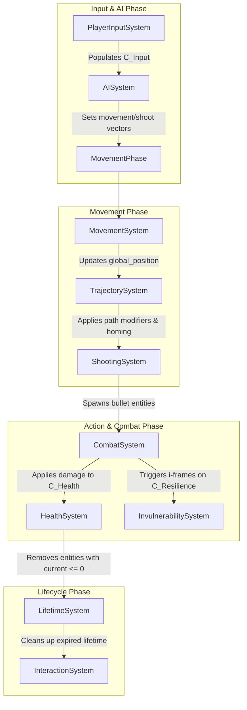

# Game & Project Overview

This project is a 2D roguelike component-based shooter prototype developed in Godot 4.7.x. It
utilizes the Godot Entity Component System (GECS) framework to construct gameplay features via
composition rather than traditional inheritance. The core gameplay loop focuses on high-performance
twin-stick shooting, movement, enemy AI, and dynamic relic collecting.

The gameplay loop proceeds as follows: the player traverses the arena, inputs movement and firing
directions to spawn and target projectiles, triggers environmental entities (like enemy spawner
buttons), and gathers relics from the battlefield. These relics stack modifiers onto player stats
and alter bullet path trajectories, scaling characters up to face increasingly aggressive enemy
behaviors.

## Repository & Entity Structure

- `addons/` - Contains external framework addons (GECS core and NodeFX animation helpers).
- `components/` - Houses raw data-only ECS Component scripts defining entity state.
- `entities/` - Holds Godot scenes and scripts inheriting from `Entity` that act as game actors.
- `resources/` - Stores data-driven Godot resources, including Relics and their associated Relic Effects.
- `scripts/` - Contains general scripts, including the main entry point `main.gd` file.
- `systems/` - Houses logic-only ECS System scripts that query and update component states.

**Delineation**:
GECS Entities (actors composed of data) reside in `entities/`, GECS Components (raw data) reside in
`components/`, and GECS Systems (logic) reside in `systems/`. Standard Godot scenes and general
scripts live under `entities/` and `scripts/`. Global framework initialization is managed via the
`ECS` Autoload mapping to GECS core scripts.

## Core GECS Architecture

The core architecture consists of modular systems that process entities containing matching sets of
components.
- **MovementSystem**: Processes entities with `C_Velocity`. Updates entity positions and decays
  knockback forces over time.
- **CombatSystem**: Static library that processes hit and contact damage. Applies armor damage
  mitigation, calculates critical hits, applies knockback, triggers invulnerability frames, and
  spawns split projectiles.
- **AISystem**: Processes entities with `C_AIStateMachine` and `C_Velocity`. Controls transitions
  between IDLE, CHASE, and SHOOT states based on target proximity.
- **ShootingSystem**: Processes entities with `C_Shooter`, `C_Velocity`, and `C_Input`. Spawns
  projectile entities matching the target firing direction.
- **TrajectorySystem**: Processes entities with `C_Velocity` and `C_Trajectory` but no `C_Input`.
  Manages path range limits, performs homing interpolation towards living targets, and runs path
  modifiers.
- **InteractionSystem**: Processes entities with `C_Input` and `C_RelicInventory`. Queries for
  nearby `C_Interactable` components and executes their designated callbacks when triggered.
- **HealthSystem**: Processes entities with `C_Health`. Cleans up dead entities.
- **ManaSystem**: Processes entities with `C_Mana`. Restores current mana levels over time.
- **InvulnerabilitySystem**: Processes entities with `C_Resilience`. Decrements active
  invulnerability frames.
- **LifetimeSystem**: Processes entities with `C_Lifetime`. Removes entities when their lifetime
  expires.
- **InteractableDebugSystem**: Processes entities with `C_InteractableDebug`. Draws debug visuals
  around interactive objects.
- `> TODO: [RoomGenerationSystem]`

**System Execution & Data Flow:**


**Linking Standard Godot Nodes to GECS Entities**:
- GECS Entities inherit from Godot's `Node` class.
- Standard visual or physics nodes (such as `Sprite2D` or `Area2D`) are attached as child nodes to
  the `Entity` node within the Godot scene tree.
- ECS Systems access these child nodes using `entity.get_node()` or `entity.get_node_or_null()` to
  run visual animations or connect to physics area signals.

## Coding Paradigms & Conventions

- **Strict Separation**: **Components must contain only data and variable exports.** They must have
  no process loop or game logic. **Systems must contain only processing logic.** They must query
  components and contain no persistent game state.
- **Naming Conventions**:
  - Components: Class names must prefix with `C_` in PascalCase. Filenames must use `c_` in
    snake_case (e.g., `C_RelicInventory` in `c_relic_inventory.gd`).
  - Systems: Class names must suffix with `System` in PascalCase. Filenames must match the class
    name (e.g., `MovementSystem` in `MovementSystem.gd`).
  - Entities: Class names should be normal PascalCase nouns. Filenames must prefix with `e_` in
    snake_case (e.g., `Player` in `e_player.gd`).
- **Linting Rules**: We follow standard Godot GDScript style guidelines. Always define static types
  for parameters, local variables, and return values.
- **Commit Messages**: We strictly require the use of Conventional Commits for commit messages. Use
  the following formats:
  - `feat: <description>` for new features (e.g., new systems, components, or relic types).
  - `fix: <description>` for bug fixes (e.g., logic errors in systems).
  - `chore: <description>` for build, tooling, or documentation updates.

## Build, Export & Development Commands

Execute the following commands in the root of the project repository.

- **Run Interactive Test Scene**:
  ```bash
  godot --path . res://test_scene.tscn
  ```
- **Run Manual Test Gym**:
  ```bash
  godot --path . res://manual_test.tscn
  ```
- **Run Headless Verification / Telemetry Simulation**:
  ```bash
  godot --headless --path .
  ```
- **Build C# Solution Assemblies (if applicable)**:
  ```bash
  dotnet build
  ```
- **Headless Release Export**:
  ```bash
  godot --headless --path . --export-release "Mac OSX" build/mac/rpg-component-system.zip
  ```

## Asset Pipeline & 2D Import Settings

- `> TODO: [2D Import Settings & Collision Layer Definitions]`

## Testing Strategy & QA

- **Headless Telemetry**: The main entry point `scripts/main.gd` executes an automated input
  timeline and outputs component updates to standard output.
- **Isolated System Testing**: Systems can be verified by instantiating them manually, creating
  mock entity instances, appending relevant test component resources, and calling the system's
  `process()` method directly.
- **Testing Gyms**: Hand-crafted scenes used to verify features:
  - `res://test_scene.tscn` - Main entry scene executing the headless simulation check.
  - `res://manual_test.tscn` - Sandbox scene with pre-spawned player, enemy, and spawner buttons.
  - `> TODO: [Bullet Pooling & Room Generation Verification Gyms]`

## Save Data & Security

- `> TODO: [Save Data Serialization & Secrets Security]`

## Agent Guardrails

- **NEVER** add logic or processing methods to Component scripts.
- **NEVER** directly couple two Systems together. Systems must communicate exclusively via
  component state changes or GECS signals.
- **NEVER** modify GECS framework core addon files located under `addons/gecs/` unless fixing a core
  engine bug.
- **NEVER** modify raw `.tscn` files directly in text editors unless resolving merge conflicts; use
  the Godot Editor UI to maintain scene file integrity.

## Extensibility & Item Modularity

- **Adding Items/Relics**: Create new custom Relic resources. Populate their effects array with
  `RelicEffect` resource instances (e.g., `StatModifierEffect`, `ApplyBulletPathEffect`, or
  `BulletSplitEffect`). Attach these to GECS entities via the `C_RelicInventory.add_relic()` method.
- `> TODO: [Loot Tables & Feature Flags Configuration]`

## Further Reading

- [GECS Core Addon README](addons/gecs/README.md)
- [GECS Getting Started Guide](addons/gecs/docs/GETTING_STARTED.md)
- [GECS Core Concepts](addons/gecs/docs/CORE_CONCEPTS.md)
- [GECS Component Queries](addons/gecs/docs/COMPONENT_QUERIES.md)
- [GECS Relationships Guide](addons/gecs/docs/RELATIONSHIPS.md)
- [GECS Observers Guide](addons/gecs/docs/OBSERVERS.md)
- [GECS Performance Optimization](addons/gecs/docs/PERFORMANCE_OPTIMIZATION.md)
- [Contributing Guidelines](docs/CONTRIBUTING.md)
