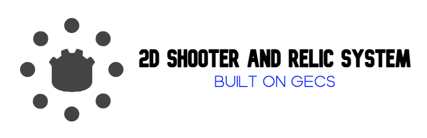

# GECS 2D Shooter & Relic System

[](https://godotengine.org)
[](https://docs.godotengine.org/en/stable/tutorials/scripting/gdscript/gdscript_basics.html)
[](LICENSE)
[](addons/gecs/README.md)

A production-grade, highly modular 2D shooter and relic prototype showcasing a clean **Entity Component System (ECS)** architecture in Godot 4.x. Powered by the **GECS (Godot ECS)** addon, the project decouples state (Components) from logic (Systems) to enable extensible gameplay features, such as bullet path modifiers, data-driven relics, and a state-machine AI.


---

## 🎯 What the Project Does

The project simulates a 2D battleground where:
- A playable **Player** shoots projectiles at **Enemies**.
- **AI Enemies** actively transition between `IDLE`, `CHASE`, and `SHOOT` states based on range.
- An **Interaction System** allows the player to pick up game-changing **Relics** from the ground or interact with triggers (like an enemy spawner button).
- project components, systems, and relic effects dynamically coordinate at runtime to calculate bullet trajectory modifications (e.g., Spiral, Orbit, Zigzag pathing), homing behavior, armor mitigation, critical hits, knockback, and bullet splitting.

---

## 🚀 Why the Project is Useful (Key Features)

### 1. Decoupled ECS Architecture
- Built on top of the [GECS addon](addons/gecs/README.md).
- Logic is completely separated into self-contained `Systems` that process list-queries of entities containing matching `Components`.
- Entities are constructed simply via composition in GDScript or through the Godot scene tree.

### 2. Extensible Relic & Effect System
- Relics are data-driven Godot resources (`.tres`) containing lists of `RelicEffect` resources.
- When collected, relics automatically apply their modifications to the player's stats or bullet behaviors:
  - **Aetheric Kernel**: Modifies max health, damage, and armor.
  - **Plasma Splitter**: Grants a chance (scaled by luck) for bullets to split into dual angled projectiles upon impact.
  - **Seeking Algorithm**: Applies tracking/homing capabilities to projectiles.
  - **Orbital Attractor**: Modifies projectile trajectory to orbit the shooter.
  - **Sine Wave Modulator**: Modifies projectile trajectory to travel in a wave pattern.
  - **Vortex Accelerator** / **Spiral Path**: Modifies projectile trajectory to spiral outwards.

### 3. Built-In Headless Simulation & Verification
- The project includes an automated test timeline in [main.gd](scripts/main.gd). When running headlessly, it simulates input sequence timelines (teleporting, shooting, collecting relics, hitting enemies) and prints telemetry output before automatically quitting.

---

## 🛠 Project Structure

```
├── .godot/                     # Godot metadata (ignored)
├── addons/
│   ├── gecs/                   # The GECS Addon (Engine Core, Docs & Inspector)
│   └── node_fx/                # Micro-animation helper utility
├── components/                 # ECS Components (State & Data only)
│   ├── behaviour/
│   │   └── c_ai_state_machine.gd
│   └── character/
│       ├── c_bullet_path.gd
│       ├── c_health.gd
│       ├── c_velocity.gd
│       └── ...
├── entities/                   # Godot Scenes acting as ECS Entities
│   ├── enemies/                # Enemy scenes & scripts
│   ├── environmental/          # Buttons, relic pickup objects
│   ├── player/                 # Player character scene & script
│   └── projectiles/            # Bullet entities
├── resources/                  # Godot Resource files (.tres) & Effect scripts
│   ├── effects/                # Concrete RelicEffect resource scripts
│   └── relics/                 # Configured Relic instances (.tres files)
├── scripts/
│   └── main.gd                 # Main entry point & simulation loop
└── systems/                    # ECS Systems (Behavior & Logic only)
    ├── AISystem.gd
    ├── CombatSystem.gd
    ├── TrajectorySystem.gd
    └── ...
```

---

## ⚡ How Users Can Get Started

### Prerequisites
- **Godot Engine 4.7+** (with support for .NET/C# if using Mono assemblies, though core is GDScript).

### Installation
1. Clone this repository:
   ```bash
   git clone https://github.com/SansKrono/2d-shooter-component-system.git
   cd 2d-shooter-component-system
   ```
2. Open the Godot Engine Project Manager, click **Import**, select `project.godot`, and open the project.
3. Ensure the **GECS** plugin is enabled in **Project -> Project Settings -> Plugins**.

### Running the Demo
- **Interactive Mode**: Press **F5** (or the play button in the top right of the Godot Editor) to run the simulation scene (`test_scene.tscn`).
- **Headless Test/Simulation**: Run the project from your terminal in headless mode to observe the simulation timeline check output:
  ```bash
  godot --headless --path .
  ```

---

## 📖 Code Examples & Usage

### 1. Composing an Entity
Entities declare their component composition using the `define_components()` lifecycle method.

```gdscript
# res://entities/player/e_player.gd
class_name Player
extends Entity

func define_components() -> Array:
	return [
		C_Health.new(100.0),
		C_Velocity.new(Vector2.ZERO, 200.0),
		C_Input.new(),
		C_Shooter.new(0.15, 500.0),
		C_RelicInventory.new()
	]
```

### 2. Creating a Custom Component (Data Only)
Components do not process logic; they define exports and initialize variables.

```gdscript
# res://components/character/c_mana.gd
class_name C_Mana
extends Component

@export var maximum: float = 100.0
@export var current: float = 100.0
@export var regeneration_rate: float = 10.0

func _init(max_mana: float = 100.0, regen: float = 10.0) -> void:
	maximum = max_mana
	current = max_mana
	regeneration_rate = regen
```

### 3. Creating a Custom System (Logic Only)
Systems query for components and execute update processes on the matching entities.

```gdscript
# res://systems/ManaSystem.gd
class_name ManaSystem
extends System

func query() -> QueryBuilder:
	# Selects all entities that possess a C_Mana component
	return q.with_all([C_Mana])

func process(entities: Array[Entity], _components: Array, delta: float) -> void:
	for entity in entities:
		var c_mana = entity.get_component(C_Mana) as C_Mana
		if c_mana and c_mana.current < c_mana.maximum:
			c_mana.current = min(c_mana.maximum, c_mana.current + c_mana.regeneration_rate * delta)
```

---

## 🔍 Where Users Can Get Help

- **Core ECS Documentation**: Read the GECS guide inside the repository at [addons/gecs/README.md](addons/gecs/README.md).
- **Step-by-Step Tutorial**: Walk through the [GECS Getting Started Guide](addons/gecs/docs/GETTING_STARTED.md).
- **Core Concepts Guide**: Read about Archetypes, Observers, and Relationships in the [GECS Core Concepts](addons/gecs/docs/CORE_CONCEPTS.md).
- **Performance Optimization**: Learn how to tune queries in the [GECS Performance Optimization Guide](addons/gecs/docs/PERFORMANCE_OPTIMIZATION.md).

---

## 👥 Who Maintains and Contributes

- **Maintainer**: Aaron Loz
- **Contributions**: Contributions are welcome! Please read the relative contribution guidelines at [docs/CONTRIBUTING.md](docs/CONTRIBUTING.md) before submitting pull requests.
- **License**: This project is licensed under the MIT License. See [LICENSE](LICENSE) for more details.
